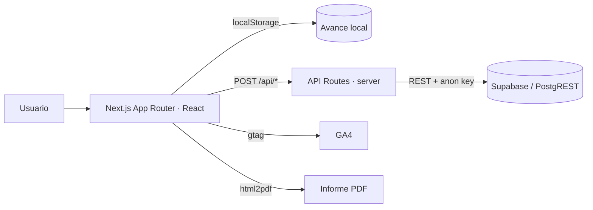

# Manual Técnico
## Herramienta de Evaluación de Impacto Algorítmico (EIA) — GobLab UAI

> Documentación para desarrolladores y mantenedores: arquitectura, estructura del
> repositorio, modelo de datos del cuestionario, lógica de visibilidad y scoring,
> endpoints de la API, persistencia en Supabase, feedback/analítica, ejecución
> local, despliegue y cómo extender la herramienta. El manual funcional está en
> [`MANUAL_USUARIO.md`](MANUAL_USUARIO.md).

---

## Índice

1. [Arquitectura general](#1-arquitectura-general)
2. [Estructura del repositorio](#2-estructura-del-repositorio)
3. [El componente central: `evaluacion-impacto-mejorada.tsx`](#3-el-componente-central-evaluacion-impacto-mejoradatsx)
4. [Modelo de datos del cuestionario](#4-modelo-de-datos-del-cuestionario)
5. [Sistema de contexto (Chile / Internacional)](#5-sistema-de-contexto-chile--internacional)
6. [Lógica de visibilidad de preguntas](#6-lógica-de-visibilidad-de-preguntas)
7. [Scoring y niveles de impacto](#7-scoring-y-niveles-de-impacto)
8. [Endpoints de la API](#8-endpoints-de-la-api)
9. [Persistencia en Supabase](#9-persistencia-en-supabase)
10. [Feedback, votos y analítica](#10-feedback-votos-y-analítica)
11. [Generación del PDF](#11-generación-del-pdf)
12. [Variables de entorno](#12-variables-de-entorno)
13. [Ejecución local](#13-ejecución-local)
14. [Despliegue](#14-despliegue)
15. [Decisiones de diseño](#15-decisiones-de-diseño)
16. [Cómo extender la herramienta](#16-cómo-extender-la-herramienta)

---

## 1. Arquitectura general

La EIA es **una sola aplicación Next.js 14** (App Router, TypeScript, React) que
contiene tanto el frontend como las *API routes*. La persistencia es **Supabase**,
accedido vía su API REST (**PostgREST**) desde las rutas del servidor. La analítica
es **Google Analytics 4 (GA4)**.

Rasgo clave: **casi toda la lógica vive en el cliente**. El cuestionario, el
scoring, la numeración, las recomendaciones y el PDF se calculan en el navegador, y
el avance se guarda en **`localStorage`**. Las *API routes* son **proxies delgados**
que reciben un POST del cliente y lo reenvían a Supabase con la *anon key*, que
**nunca se expone al navegador** (no lleva prefijo `NEXT_PUBLIC_`).



| Capa | Tecnología |
|---|---|
| Framework | Next.js 14 (App Router) |
| Lenguaje | TypeScript + React |
| Estilos | Tailwind CSS + shadcn/ui (Radix) + sistema propio "civic" |
| Iconos | lucide-react + `civic-icons` propios |
| Persistencia | Supabase (PostgREST REST API) |
| Analítica | Google Analytics 4 |
| PDF | `html2pdf.js` / `jspdf` |
| Gestor de paquetes | pnpm |

---

## 2. Estructura del repositorio

```
src/
├── app/
│   ├── layout.tsx              # Metadata + carga de GA4
│   ├── page.tsx               # Home → LandingPage
│   ├── globals.css
│   ├── evaluacion/page.tsx    # Lee ?email y ?contexto, monta el cuestionario
│   ├── privacidad/page.tsx    # Política de privacidad
│   └── api/
│       ├── register/route.ts  # → tool_users
│       ├── survey/route.ts    # → tool_survey (fallback a tool_feedback)
│       ├── feedback/route.ts  # → tool_feedback (+ columnas de contexto)
│       └── vote/route.ts      # → tool_question_vote (votos 👍/👎)
├── components/
│   ├── LandingPage.tsx                 # Portada: contexto, correo, origen
│   ├── evaluacion-impacto-mejorada.tsx # ★ Núcleo: preguntas, scoring, resultados, PDF
│   ├── FeedbackPill.tsx                # Botón flotante + modal de feedback
│   ├── QuestionFeedback.tsx            # 👍/👎 + comentario por pregunta
│   ├── SatisfactionSurvey.tsx          # Encuesta de satisfacción (11 preguntas)
│   ├── Thermometer.tsx                 # Visual del puntaje por dimensión
│   ├── civic-icons.tsx                 # Iconos y logos del sistema de diseño
│   └── ui/                             # Primitivas shadcn/ui (Radix)
├── data/
│   └── survey.ts              # Definición de la encuesta de satisfacción
├── lib/
│   ├── contexto.ts           # Tipo Contexto + helpers de resolución de texto
│   ├── feedback.ts           # sendFeedback / sendSurvey / sendVote / buildDescription
│   ├── analytics.ts          # Eventos GA4
│   ├── civic.ts              # Tokens del sistema de diseño (colores, fuentes)
│   └── utils.ts
├── hooks/use-toast.ts
supabase/migrations/
├── 001_tool_survey.sql       # tool_survey + columnas de contexto en tool_feedback
├── 002_tool_users_origin.sql # columna origin en tool_users
└── 003_question_votes.sql    # tool_question_vote (votos 👍/👎)
docs/
├── manual/                   # Este manual
└── eia-gen/                  # Notas del desarrollo Hito 1/2 (IA generativa)
```

---

## 3. El componente central: `evaluacion-impacto-mejorada.tsx`

Es el corazón de la herramienta (~3.000 líneas). Contiene, en módulo:

- `const dimensions: string[]` — las 11 dimensiones, en orden.
- `const questions: Question[]` — **todas** las preguntas (universales, IAGen y por
  contexto). Hoy son ~111 definiciones.
- `const recommendations: Recommendation[]` — las recomendaciones por pregunta.

Y dentro del componente React:

- Estado: `answers`, `totalScore`, `scoreByDimension`, `flags` (👍/👎), `surveySent`,
  `contexto`, etc.
- `forContexto(question)` — aplica los `overrides` del contexto activo.
- `shouldShowQuestion(question, answers)` — decide si una pregunta es visible (§6).
- `calculateTotalScore(answers)` / `getScoreByDimension(answers)` — scoring (§7).
- `getImpactLevel(score)` — mapea el puntaje a nivel (§7).
- Render de: barra lateral de dimensiones, preguntas de la sección, resultados
  (puntaje, `Thermometer`, recomendaciones, PDF, `SatisfactionSurvey`).

> Consecuencia práctica: numeración visible, progreso, "sección completa" y scoring
> **se derivan todos de `shouldShowQuestion`**. Es el único punto a tocar para
> cambiar qué se ve.

---

## 4. Modelo de datos del cuestionario

Cada pregunta es un objeto `Question`. Campos principales:

```ts
type Question = {
  id: string                 // "q1", "q31", "q102", "d04_q35"… (no siempre correlativo)
  text: string               // enunciado (contexto base)
  type: 'text' | 'yesno' | 'select' | 'multiselect'
  dimension: string          // una de las 11 dimensiones
  stage: string              // fase: "Conceptualización y diseño" | "Recolección…" | "Uso y monitoreo"
  options?: Option[]         // para select / multiselect
  info?: string              // tooltip (soporta \n y **negrita**)

  // Scoring (opcional): solo las preguntas "clásicas" puntúan
  scoreContribution?: boolean
  score?: (answer: Answer) => number

  // Visibilidad condicional
  dependsOn?: { questionId: string; value: boolean | string | string[] | ((a: Answer) => boolean) }

  // Bifurcación y contexto
  track?: 'universal' | 'iagen'          // 'iagen' solo si answers['qGen'] === true
  soloContexto?: 'chile' | 'internacional'
  overrides?: Partial<Record<Contexto, { text?: string; info?: string; options?: Option[] }>>
}
```

Las **recomendaciones**:

```ts
type Recommendation = {
  questionId: string
  recommendations: Array<{
    text: string | Partial<Record<Contexto, string>>  // texto único o por contexto
    condition: (answer: Answer) => boolean             // cuándo mostrarla
    resource?: string
    soloContexto?: Contexto                            // variante exclusiva de un contexto
  }>
}
```

Notas de diseño del modelo:
- Los `id` **no son correlativos**: hay sub-ids (`q28.1`) y prefijos por herramienta
  (`d04_q35`). Cualquier script debe recorrer con `q[\w.]+`, nunca `q\d+`.
- El texto por defecto es el del **contexto base (Chile)**; `overrides.internacional`
  reemplaza `text`/`info`/`options` cuando el contexto activo es internacional.
- Las preguntas nuevas (IA generativa y dimensiones recientes) entran con
  `scoreContribution: false` — ver §7.

---

## 5. Sistema de contexto (Chile / Internacional)

Definido en [`src/lib/contexto.ts`](../../src/lib/contexto.ts):

```ts
type Contexto = 'chile' | 'internacional'
const CONTEXTO_DEFAULT: Contexto = 'chile'
// helpers: esContexto, normalizarContexto, labelContexto, resolverTexto
type TextoPorContexto = string | Partial<Record<Contexto, string>>
```

- El contexto se elige en `LandingPage` y viaja como query param:
  `/evaluacion?email=…&contexto=chile|internacional`.
- `evaluacion/page.tsx` lo lee y lo pasa como `initialContexto`.
- En el componente, `forContexto(question)` fusiona `question.overrides[contexto]`
  sobre la pregunta base. Para recomendaciones, `resolverTexto()` elige el string
  del contexto activo cuando `text` es un mapa `{ chile, internacional }`.

Reglas de negocio del contexto:
- `soloContexto: 'chile' | 'internacional'` → la pregunta/recomendación aparece
  **solo** en ese contexto.
- Los textos internacionales están **neutralizados** (no citan leyes chilenas;
  remiten a "la normativa vigente en su país").

---

## 6. Lógica de visibilidad de preguntas

Todo pasa por `shouldShowQuestion(question, answers)`, en este orden:

1. **Contexto**: si `question.soloContexto` existe y ≠ contexto activo → oculta.
2. **Bifurcación IAGen**: si `question.track === 'iagen'` y `answers['qGen'] !== true`
   → oculta.
3. **Salto condicional D6 (solo internacional)**: si el contexto es internacional,
   la pregunta pertenece a *Protección de datos*, no es `q102`, y `answers['q102'] === false`
   (el país declara no tener ley de protección de datos) → oculta el resto de la
   dimensión (y por tanto no puntúa).
4. **`dependsOn`**: evalúa el valor de la pregunta padre. La condición puede ser un
   valor (`=== value`), un arreglo (`incluye todos`) o una **función** `(a) => boolean`.

Como `progress`, `dimensionProgress`, `isDimensionComplete` y la numeración visible
se calculan sobre las preguntas que pasan este filtro, **no hay que tocar nada más**
para que una pregunta oculta desaparezca de todos los cálculos.

---

## 7. Scoring y niveles de impacto

```ts
const MIN_SCORE = 18.32

calculateTotalScore(answers):
  rawScore = Σ question.score(answers[id])   // solo si question.scoreContribution && question.score
  return Math.max(rawScore, MIN_SCORE)

getScoreByDimension(answers):
  // mismo cálculo, agrupado por dimensión

getImpactLevel(score):
  score <= 18.32 → "Bajo impacto"
  score <= 45.54 → "Impacto moderado"
  score <= 72.77 → "Alto impacto"
  else           → "Impacto muy alto"
```

- La escala es **0–100** (mostrada como `%`), con piso `MIN_SCORE`. El
  `Thermometer` usa `minScore=18.32`, `maxScore=100`.
- **Solo las preguntas "clásicas"** llevan `scoreContribution: true` y una función
  `score`. Las preguntas incorporadas en el desarrollo de IA generativa y las
  dimensiones nuevas entran con **`scoreContribution: false`** (decisión de producto:
  el scoring de esas preguntas está pendiente de definición). Documentarlo al
  usuario evita la sorpresa de "respondí mucho y el puntaje no se movió".

> Al agregar preguntas nuevas, **déjalas en `scoreContribution: false`** salvo que
> se defina explícitamente su fórmula de puntaje.

---

## 8. Endpoints de la API

Todas son *route handlers* (`POST`) en `src/app/api/*/route.ts`. Reciben JSON del
cliente y hacen `fetch` a `${SUPABASE_URL}/rest/v1/<tabla>` con la *anon key* y
`Prefer: return=minimal`. Todas **degradan con gracia** para no perder datos ni
romper la UX.

| Ruta | Tabla destino | Qué hace |
|---|---|---|
| `POST /api/register` | `tool_users` | Registra `{ email, tool_name, origin }`. `201`→ok, `409`→ya existía (también ok). |
| `POST /api/survey` | `tool_survey` | Guarda la encuesta con **una columna por pregunta** (`p2…p11`). Si la tabla no existe, cae a `tool_feedback` como texto (no pierde la respuesta). |
| `POST /api/feedback` | `tool_feedback` | Comentario con contexto (`pantalla, seccion, pregunta, question_id, progreso`) en columnas propias **y** embebido en `description`. Si las columnas no existen, reintenta sin ellas. |
| `POST /api/vote` | `tool_question_vote` | Voto 👍/👎 de claridad `{ questionId, helpful, pregunta, seccion }`. Sin datos personales. Si la tabla no existe, responde `success:false` sin romper el cuestionario. |

Ejemplo de contrato (`/api/vote`):

```jsonc
// request
{ "questionId": "q31", "helpful": true, "pregunta": "6.6", "seccion": "06 Protección de datos" }
// response ok
{ "success": true }
// tabla ausente o error → NO 500, para no interrumpir la UX
{ "success": false, "error": "No se pudo registrar el voto" }
```

---

## 9. Persistencia en Supabase

Se accede por **PostgREST** (`/rest/v1/<tabla>`). La *anon key* solo se usa en el
servidor. Las tablas y su RLS se definen en `supabase/migrations/` (SQL idempotente,
se ejecuta en el **SQL Editor** de Supabase).

| Tabla | Contenido | RLS |
|---|---|---|
| `tool_users` | Registro de inicio (`email`, `tool_name`, `origin`). Compartida por todas las herramientas GobLab. | insert anón |
| `tool_survey` | Encuesta de satisfacción, una columna por pregunta (`p2_facilidad_uso`…`p11_correo`). | **insert-only** (sin SELECT anón: contiene datos de contacto) |
| `tool_feedback` | Comentarios escritos + contexto (`pantalla, seccion, pregunta, question_id, progreso`). | insert + **select** anón |
| `tool_question_vote` | Votos 👍/👎 por pregunta (`question_id, pregunta, seccion, helpful`). Sin PII. | insert + **select** anón |

- **`tool_survey` no es legible con la anon key** (protege `p11_nombre/apellido/correo`).
  Para reportes existe la **vista `tool_survey_reporte`**, que expone las mismas
  filas **sin** las columnas de contacto y sí es legible.
- `tool_question_vote` permite SELECT anónimo **a propósito** (no guarda datos
  personales), para poder agregar los conteos en tableros.

**Migraciones**:
- `001_tool_survey.sql` — crea `tool_survey` y añade columnas de contexto a `tool_feedback`.
- `002_tool_users_origin.sql` — añade `origin` a `tool_users`.
- `003_question_votes.sql` — crea `tool_question_vote` con RLS de insert y select anónimo.

> Las migraciones se corren **manualmente** en Supabase. El código degrada si una
> tabla/columna aún no existe, así que desplegar antes de migrar no rompe nada.

---

## 10. Feedback, votos y analítica

**`src/lib/feedback.ts`**
- `sendFeedback({ category, text, email?, organization?, context? })` — POST a
  `/api/feedback`. Lanza si falla (cada llamador decide cómo avisar).
- `sendSurvey({ respuestas, texto, email?, progreso? })` — POST a `/api/survey`.
- `sendVote({ questionId, helpful, context? })` — **fire-and-forget** a `/api/vote`;
  nunca lanza ni bloquea. No envía correo.
- `buildDescription(text, ctx)` — antepone una línea `[pantalla · sección · pregunta · progreso]`
  al texto, para dejar el contexto legible dentro de `description`.

**`src/lib/analytics.ts`** (GA4, vía `gtag`)
- `trackToolStart`, `trackQuestionFeedback(questionId, helpful)`, `trackFeedbackSubmit(category, screen)`.
- El 👍/👎 se registra **como evento GA4 y como voto en Supabase** (`tool_question_vote`).

**Componentes de feedback**
- `FeedbackPill` — patrón "pill flotante + modal" con el contexto capturado.
- `QuestionFeedback` — 👍/👎 por pregunta; 👎 abre panel de motivos que persiste en
  `tool_feedback`; ambos disparan `sendVote` + evento GA4.
- `SatisfactionSurvey` — 11 preguntas (escalas 1–7, sí/no, texto), definidas en
  [`src/data/survey.ts`](../../src/data/survey.ts); se envían con `sendSurvey`.

---

## 11. Generación del PDF

Se usa **`html2pdf.js`** (que envuelve `jspdf` + `html2canvas`), cargado con
`require('html2pdf.js')` en el momento de exportar (solo cliente). El informe se
arma **desde el DOM** de la pantalla de resultados:

```ts
const opt = { /* margin, filename */, jsPDF: { unit: 'mm', format: 'A4', orientation: 'portrait' }, /* … */ }
html2pdf().set(opt).from(pdfContent).save()
```

Como se renderiza desde el DOM, cualquier cambio visual en resultados se refleja en
el PDF sin trabajo extra.

---

## 12. Variables de entorno

`.env.local` (no versionado):

```env
SUPABASE_URL=...              # Project Settings → API
SUPABASE_ANON_KEY=...         # anon/public key — SOLO servidor (sin NEXT_PUBLIC_)
SUPABASE_TOOL_NAME=evaluacion de impacto   # nombre con que se etiquetan las filas
NEXT_PUBLIC_VERSION=5.0.0     # versión mostrada en la UI
NEXT_PUBLIC_GA_MEASUREMENT_ID=G-XXXX       # opcional; sin esto, GA4 no carga
```

> **Nunca** pongas la anon key con prefijo `NEXT_PUBLIC_`: quedaría expuesta al
> navegador. Se usa solo en las *API routes* (servidor).

---

## 13. Ejecución local

Requisitos: **Node.js 18+** y **pnpm**.

```bash
pnpm install
# crea .env.local (ver §12)
pnpm dev            # http://localhost:3000
```

Otros scripts:

```bash
pnpm build          # build de producción (corre lint + type-check de Next)
pnpm start          # sirve el build
pnpm lint           # ESLint (next lint)
npx tsc --noEmit    # type-check aislado
```

> Recomendación operativa: no corras `pnpm dev` y `pnpm build` a la vez sobre el
> mismo árbol (puede corromper `.next`). Detén el dev server antes de `build`.

---

## 14. Despliegue

- Diseñada para **Vercel** (Next.js nativo). Cada push a `main` puede disparar un
  deploy.
- Configura las variables de §12 en el panel del proveedor (las `SUPABASE_*` como
  **server-side**, no públicas).
- Antes de que el feedback/votos funcionen en producción, corre las **migraciones**
  001–003 en el SQL Editor de Supabase (§9). Sin ellas, las rutas degradan y no
  registran, pero la herramienta funciona.

---

## 15. Decisiones de diseño

- **Anon key server-side.** El cliente nunca ve credenciales de Supabase; las rutas
  actúan de proxy.
- **Autoguardado en `localStorage`.** Sin backend de sesiones: el avance vive en el
  navegador, asociado al correo. Simplifica la infraestructura a costa de que el
  avance no viaje entre dispositivos.
- **Degradación en cascada.** Cada ruta reintenta o responde sin error si falta una
  tabla/columna, para **no perder envíos** ni romper la UX cuando una migración va
  por detrás del deploy.
- **Scoring conservador.** Las preguntas nuevas no puntúan hasta definir su fórmula;
  así el puntaje histórico se mantiene comparable.
- **Contexto por overrides, no por duplicación.** Una sola definición de pregunta
  con `overrides`/`soloContexto` evita mantener dos cuestionarios en paralelo.
- **Un archivo núcleo.** `questions`/`recommendations` viven junto a la lógica de
  render. Es cómodo para editar contenido, pero el archivo es grande; si crece más,
  evaluar extraer los datos a `src/data/`.

---

## 16. Cómo extender la herramienta

**Agregar una pregunta**
1. Añade un objeto `Question` al array `questions`, en la posición correcta de su
   dimensión (el orden del array define la numeración visible).
2. Usa un `id` nuevo (no reutilices ids liberados).
3. Define `dimension`, `stage`, `type` y, si aplica, `options`, `dependsOn`,
   `track: 'iagen'` o `soloContexto`.
4. Déjala en `scoreContribution: false` salvo que definas su `score` (§7).

**Agregar una recomendación**
- Añade una entrada `{ questionId, recommendations: [{ text, condition, soloContexto? }] }`
  al array `recommendations`. `text` puede ser `{ chile, internacional }`.

**Adaptar una pregunta al contexto internacional**
- Agrega `overrides: { internacional: { text?, info?, options? } }`. Si es exclusiva
  de un contexto, usa `soloContexto`.

**Agregar una dimensión**
- Añádela al array `dimensions` (define el orden y las etiquetas del radar/tablero)
  y crea sus preguntas con esa `dimension`.

**Agregar un endpoint / tabla**
- Sigue el patrón de las rutas existentes (proxy a PostgREST con degradación) y crea
  la migración SQL idempotente correspondiente en `supabase/migrations/`.

Tras cualquier cambio: `npx tsc --noEmit`, `pnpm build`, y verificación en el
navegador (contexto Chile e Internacional, con y sin IA generativa).

---

*Herramienta desarrollada por **GobLab UAI** — Escuela de Gobierno, Universidad
Adolfo Ibáñez. Con el apoyo de ANID / Subdirección de Investigación Aplicada
(proyectos IT25I0161 e ID23I10357).*
